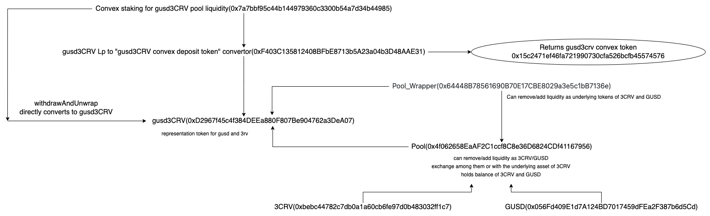

## Yearn
- Noraml yearn token : i.e. `yvUSDC`, `yvUSDT`, `yvWETH`
- Curve lp yearn token: `yvCURVE_FRAX`

## Convex
Operations on convex contracts:
- `convex booster`: 
    * deposit(curve lp token -> cvxlptoken) and can also stake them in reward pools. 
    * Another supported operation is withdraw(cvxlptoken -> curve lp token).
- `convex reward base pool`: 
    * Stake cvxlptoken in the reward pool.
    * withdrawAndUnwrap(withdraw from staking, if claim is set withdraw extra rewards). 

To represent staked cvxlpToken we use a noval concept in gearbox called [phantomToken]().

## Curve
There are three types of curve pools that we deal in gearbox:

- `3plaincrvSUSD` - There are two contracts for susd curve pool: pool and deposit contract. Pool contract doesn't have method for adding liquidity in any single coin. So we are using deposit contract, which has method that gearbox uses `remove_liquidity_one_coin`.
- `stETHCrv` - There are pool and gateway contract for stETHCrv. Gateway has the method for dealing with wrapper eth whereas pool deals with native eth. Pool contract has `calc_withdraw_one_coin` function, used by pathfinder the calculating `stETH` or `weth` we will get from withdrawing curve lp.
- `Normal curve asset`: For these we only need to track the pool contract. They also have either special wrapper or a generic wrapper contract over them for directly withdrawing to underlying asset like DAI, USDC, USDT. Gearbox leads with pools to use same approach for all remaining curve pools.

Example of generic wrapper over gusd3crv pool(also shows the convex relation):

## Uniswap v2/v3

Swapping allowed asset to underlying token. List of allowed those that this implementation supports is in [actions.jsonnet](../configs/actions.jsonnet).

> Note: Details of all operations supported by this liquidator in multicall and methods used for getting swapped outToken amount is in [actions.jsonnet](../configs/actions.jsonnet).